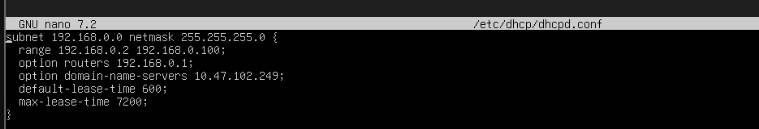
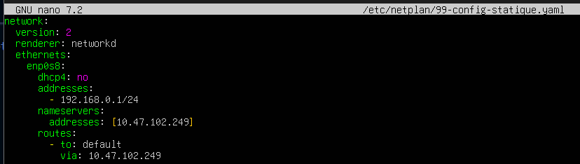
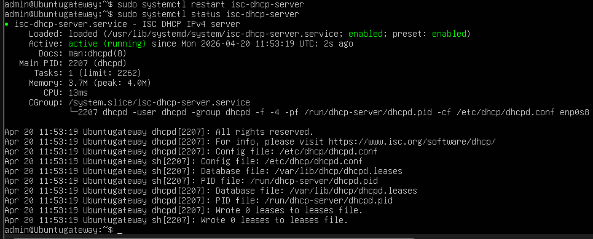
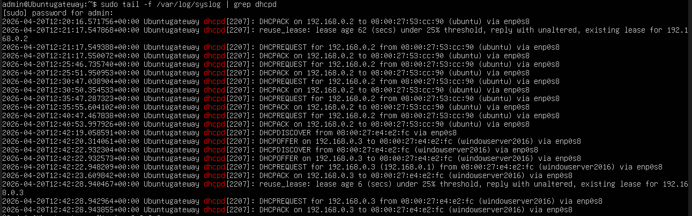

# Ubuntu Server Network Administration

For this exercise, we will simulate a network with an Ubuntu server acting as a DHCP server. We will also have an internal network with client machines that connect to the DHCP server to obtain an IP address and use the external network's DNS IP for domain name resolution.

PS: Client machines must have an "internal" network card and the network name must be the same as the server's. (Example: "lab_diaz" in our case).
Client machines must have a same network name to be on the same switch.

## 1. Server Configuration

- Two network cards:
    - One in bridge mode (connected to the local network providing Internet access).
    - One in internal mode (connected to the internal network, which will serve as the gateway for the internal network).

## 2. Network Interface Configuration

The bridge interface must have a reserved or static IP address (so as not to have to change the configuration each time the server is restarted) and configure the internal interface with a static IP address.

## 3. Enabling Routing

- Activate routing (We will propose two methods to do it):
    - `sysctl -w net.ipv4.ip_forward=1`

    - `sudo nano /proc/sys/net/ipv4/ip_forward`:
    This file has a base value of 0 and we will have to assign it the value 1 to activate routing.

- Verifying Routing:

    - `sysctl net.ipv4.ip_forward`

    - `cat /proc/sys/net/ipv4/ip_forward`


## 4. DHCP Server Configuration

- DHCP Server Installation:

    - `sudo apt update`
    - `sudo apt install isc-dhcp-server`

- DHCP Server Configuration:

    - `sudo nano /etc/default/isc-dhcp-server`
        `INTERFACESv4="enp0s8"` (internal network interface, the one that will receive DHCP requests).
        `INTERFACESv6=""`

    - `sudo nano /etc/dhcp/dhcpd.conf`
        ```text
        subnet (network address) netmask (network mask) {
            range (start IP address) (end IP address);     # Range of distributed IPs
            option routers (gateway IP address);           # Default gateway (IP of the internal interface)
            option domain-name-servers (DNS server IP);    # DNS
            default-lease-time 600;  # Lease time in seconds
            max-lease-time 7200;     # Maximum lease time in seconds
            }
        ```
        

    Netplan is a network configuration tool for Ubuntu.
    - It is located in the `/etc/netplan/` folder.
    - It is written in YAML.
    - It consists of two parts:
        - A part for the network card in bridge mode.
        - A part for the network card in internal mode.

    Create a new yaml file with a high number so that it is the last one read by the server and replaces the previous configurations:

    - `sudo nano /etc/netplan/99-config-static.yaml`

          ```yaml
          network:
            version: 2
            renderer: networkd
            ethernets:
                enp0s8:
                dhcp4: no
                addresses:
                    - x.x.x.x/az    # Your server's static IP
                nameservers:
                    addresses: [x.x.x.x, y.y.y.y] # DNS servers
                routes:
                    - to: default
                    via: x.x.x.x  # Your box or router IP
          ```
        
    - `sudo netplan try` (To test configurations).
    - `sudo netplan apply` (To permanently apply configurations).

- DHCP Server Verification:
    - `sudo systemctl (re)start isc-dhcp-server`
    - `sudo systemctl status isc-dhcp-server`
    


    In case of error, type the command `sudo journalctl -xeu isc-dhcp-server` to see exactly which line of the config file is causing the problem.
    To consult the logs, you can type the command `sudo tail -f /var/log/syslog | grep dhcpd`.
    
    Ubuntu VM (Client):
    - Release the old IP:
    `sudo dhclient -r`
    - Request a new IP (verbose mode to see the exchanges):
    `sudo dhclient -v`

    Windows VM (Client):
    - `ipconfig /release`
    - `ipconfig /renew`

    
    We can see here that the Ubuntu and Windows machines are being assigned IP parameters by the DHCP server.

## 5. NAT Configuration (Masquerading)

For internal network clients to access the Internet via the server's bridge interface, NAT must be configured with `iptables`.

- NAT Rule Configuration:
    - `sudo iptables -t nat -A POSTROUTING -o enp0s3 -j MASQUERADE` (Replace `enp0s3` with your bridge interface name).

- Make the rule persistent:
    - `sudo apt install iptables-persistent`
    - `sudo netfilter-persistent save`
    
